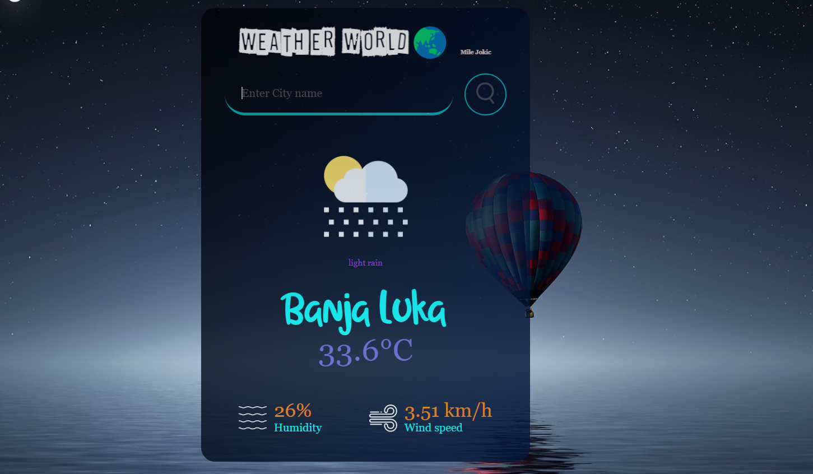

# Weather App

## Link:
https://vremensk-prognoza-milejokic.netlify.app/
app je prilagodjena i za mobilne uređaje

Predstavlja aplikaciju za prikaz vremenskih podataka na osnovu unetog imena grada. Koristeći **OpenWeather API**, aplikacija prikazuje osnovne podatke o vremenu, kao što su temperatura, vlažnost vazduha, brzina vetra, kao i ikonu vremenskog stanja.

## Funkcionalnosti

- **Prikaz trenutnih vremenskih podataka** za bilo koji grad.
  - Temperatura (u stepenima Celzijusa).
  - Vlažnost vazduha (procentualno).
  - Brzina vetra (u km/h).
  - Kratak opis vremenskih uslova (sunčano, oblačno, kišovito itd.).
  - Prikaz ikone vremenskih uslova.
- **Pretraga gradova** putem polja za unos.
  - Mogućnost pretrage klikom na dugme ili pritiskom na **Enter**.
- **Podrazumevani grad**: Na početku aplikacija prikazuje vreme za grad **Banja Luka**.

- **Greška u pretrazi**: Prikazuje poruku o grešci ako grad nije pronađen.

## Tehnologije Korišćene

- **HTML**: Za osnovnu strukturu korisničkog interfejsa.
- **CSS**: Za stilizovanje aplikacije i prikaz vremenskih podataka.
- **JavaScript**: Za dinamičko dohvatanje podataka sa API-ja, validaciju pretrage i ažuriranje korisničkog interfejsa.
- **OpenWeather API**: Za dobijanje vremenskih podataka.
- Koristi se OpenWeather API. Za rad sa ovim API-jem, potrebno je imati važeći API ključ. API ključ je definisan u JavaScript fajlu kao apiKey.

